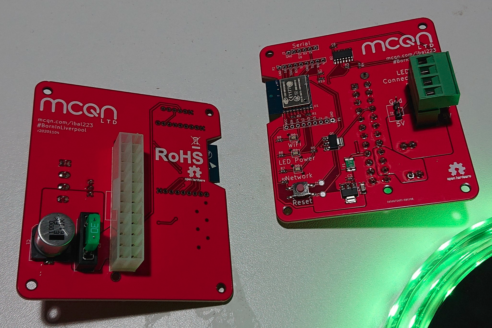

# My Babys Got LED

An ESP8266 board to drive Neopixel/WS2812 LED strips.

See the [My Baby's Got LED product page](https://mcqn.com/ibal223) on the MCQN website for full details, and for the link to buy one.

