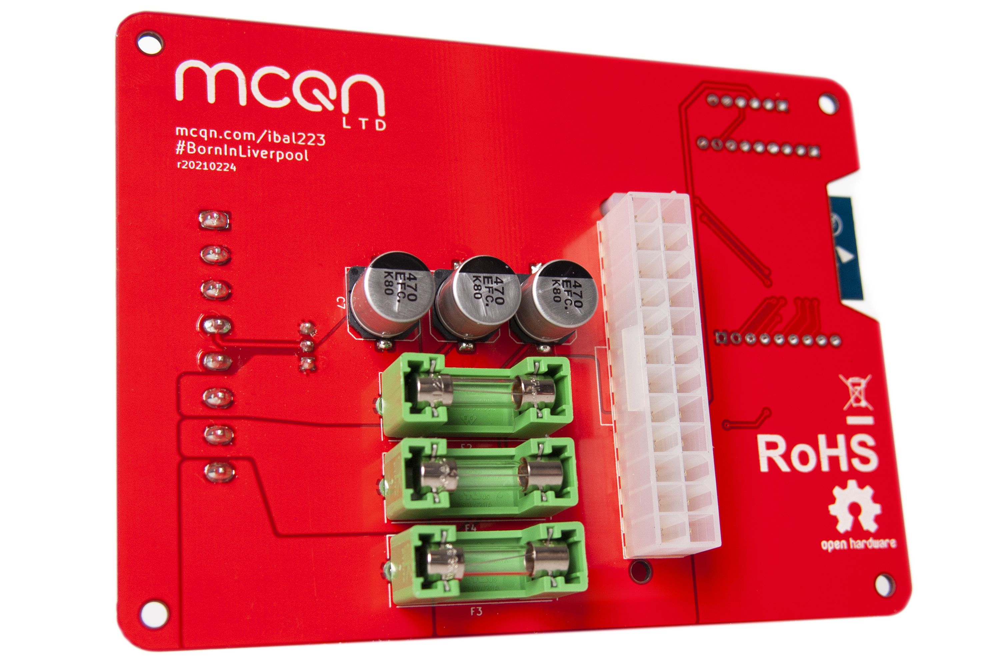
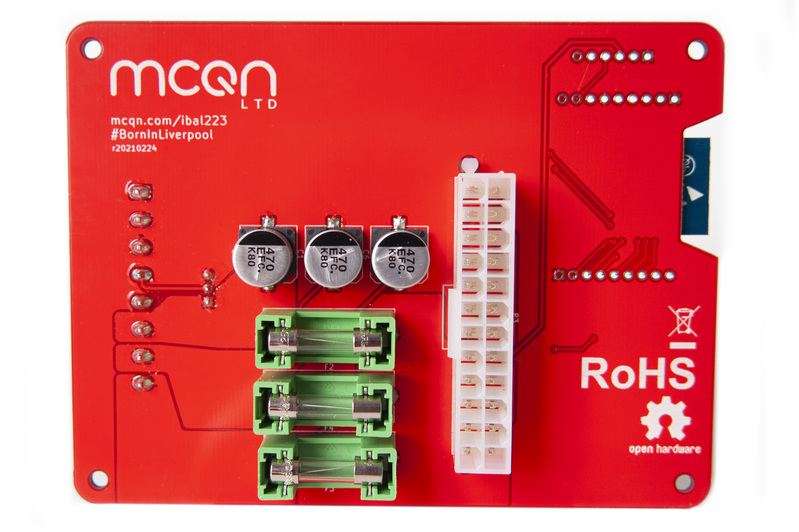
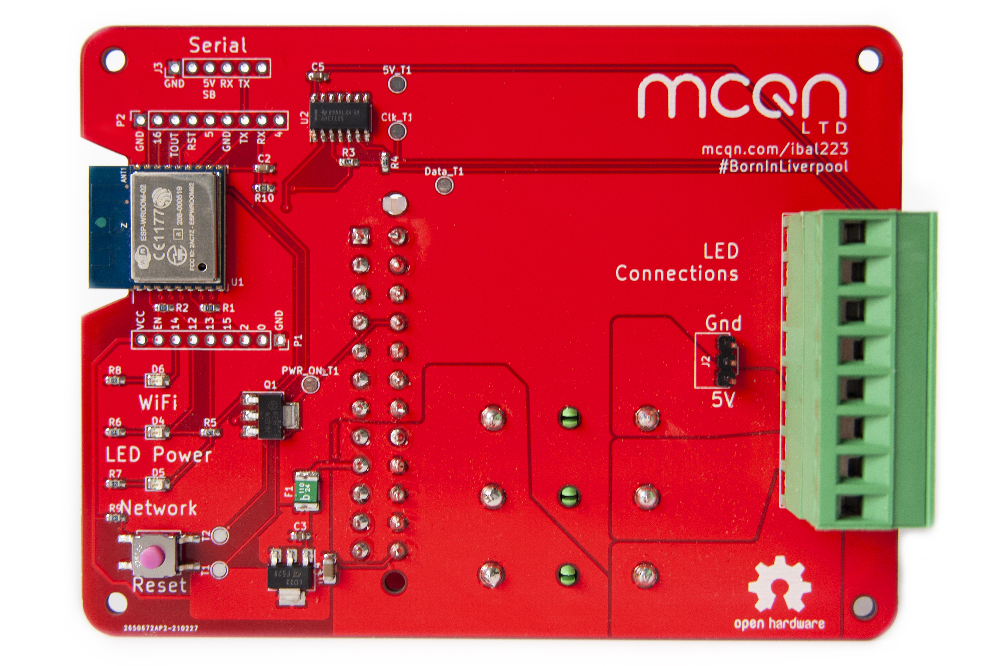
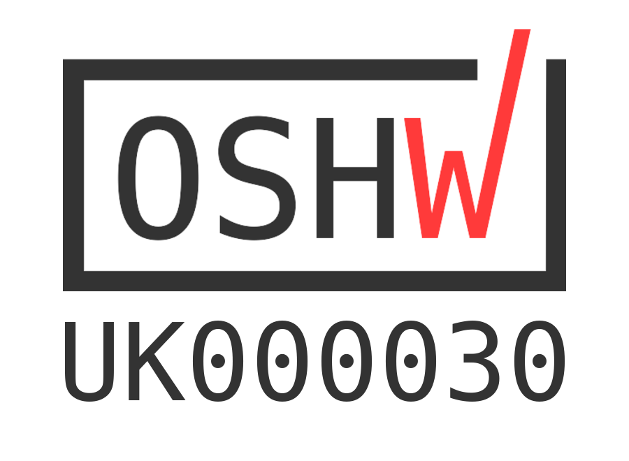

# My Babys Got LED

An ESP8266 board to drive Neopixel/WS2812 LED strips, for plug-and-play use with an ATX power supply. The board is [OSHW certified](https://certification.oshwa.org/uk000031.html
). Latest version now has three injection points with 8A fuses for safety, to manage the high power of ATX power supplies.

See the [My Baby's Got LED product page](https://mcqn.com/ibal223) on the MCQN website for full details.

The finished product is available for sale on Tindie:

